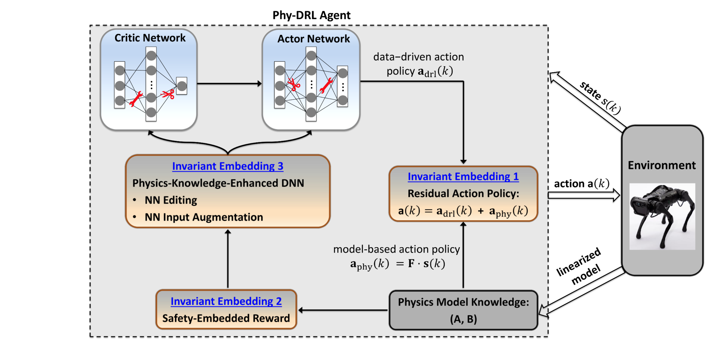

<!-- PROJECT LOGO -->
<br />
<p align="center">
  <h1 align="center"> Physics-regulated Deep Reinforcement Learning: Invariant Embeddings </h1>
  <p align="center">
    <br />
  </p>

# Phy-DRL

This paper proposes the Phy-DRL: a physics-regulated deep reinforcement learning (DRL) framework for safety-critical autonomous systems. The Phy-DRL has three distinguished invariant-embedding designs: i) residual action policy (i.e., integrating data-driven-DRL action policy and physics-model-based action policy), ii) (automatically construct) safety-embedded reward, and iii) physics-model-guided neural network (NN) editing, including link editing and activation editing. Theoretically, the Phy-DRL exhibits 1) mathematically-provable safety guarantee, and 2) strict compliance of critic and actor networks with physics knowledge about the action-value function and action policy. Finally, we evaluate the Phy-DRL on a cart-pole system and a quadruped robot. The experiments validate our theoretical results and demonstrate that Phy-DRL features guaranteed safety compared to purely data-driven DRL and solely model-based design, while offering remarkably fewer learning parameters and fast training towards safety guarantee.

### Environment
This project is using the following settings:

- Ubuntu: 20.04 
- python: 3.8

### Package in python

```
pip install -r requirement.txt
```

### Package in Matlab

Download and install[CVX](http://cvxr.com/cvx/) package.

## Run experiments for Inverted pendulum

```
main_ips.py [-h] [--config CONFIG] [--generate_config] [--force]
                  [--params [PARAMS [PARAMS ...]]] [--mode MODE]
                  [--gpu] [--id RUN_ID][--weights PATH_TO_WEIGHTS] 

arguments:
  --config             Specifying different configuration .json files for different test.
  --generate_config    Generating default configuration .json files. 
  --force              Over-writting the previous run of same ID.
  --params             Over-writting params setting.
  --gpu                Enabling gpu device to speed up training. Training using CPU if not specified.   
  --mode MODE          Training or testing [train|test]
  --id                 Assigning an ID for the training/testing.
  --weights            Loading pretrained weights.    
```


Example_1: Generate configuration file

```
python main_ips.py --generate_config
```

Example_2: Training/Testing

```
python main_ips.py --config {PATH_TO_CONFIG_FILE} --mode {train|test} --id {RUN_NAME} --gpu --weights {PATH_TO_PRETRAINED_WEIGHTS}
```

Example_2: evaluation

```
python evalutation/eval_xxx.py --config {PATH_TO_CONFIG_FILE} --id {RUN_NAME} --weights {PATH_TO_PRETRAINED_WEIGHTS}
```

Solving LMIs to get matrix P and control feedback law by running **solve_limis.m** in matlab.


## Run experiments for quadruped Robot

### Setup for Local PC

It is recommended to create a separate virtualenv or conda environment to avoid conflicting with existing system
packages. The required packages have been tested under Python 3.8.5, though they should be compatible with other Python
versions.

Follow the steps below to build the Python environment:

1. First, install all dependent packages by running:

   ```bash
   pip install -r requirements.txt
   ```

2. Second, install the C++ binding for the convex MPC controller:

   ```bash
   python setup.py install
   ```

3. Lastly, build and install the interface to Unitree's SDK. The
   Unitree [repo](https://github.com/unitreerobotics/unitree_legged_sdk) keeps releasing new SDK versions. For
   convenience, we have included the version that we used in `third_party/unitree_legged_sdk`.

   First, make sure the required packages are installed, following
   Unitree's [guide](https://github.com/unitreerobotics/unitree_legged_sdk?tab=readme-ov-file#dependencies). Most
   nostably, please make sure to
   install `Boost` and `LCM`:

   ```bash
   sudo apt install libboost-all-dev liblcm-dev
   ```

   Then, go to `third_party/unitree_legged_sdk` and create a build folder:
   ```bash
   cd third_party/unitree_legged_sdk
   mkdir build && cd build
   ```

   Now, build the libraries and move them to the main directory by running:
   ```bash
   cmake ..
   make
   mv robot_interface* ../../..
   ```

### Setup for Real Robot

Follow the steps if you want to run controllers on the real robot:

1. **Setup correct permissions for non-sudo user (optional)**

   Since the Unitree SDK requires memory locking and high process priority, root priority with `sudo` is usually
   required to execute commands. To run the SDK without `sudo`, write the following
   to `/etc/security/limits.d/90-unitree.conf`:

   ```bash
   <username> soft memlock unlimited
   <username> hard memlock unlimited
   <username> soft nice eip
   <username> hard nice eip
   ```

   Log out and log back in for the above changes to take effect.

2. **Connect to the real robot**

   Configure the wireless on the real robot with the [manual](docs/A1_Wireless_Configuration.pdf), and make sure
   you can ping into the robot's low-level controller (IP:`192.168.123.10`) on your local PC.

[//]: # (3. **Test connection**)

[//]: # ()

[//]: # (   Start up the robot. After the robot stands up, enter joint-damping mode by pressing L2+B on the remote controller.)

[//]: # (   Then, run the following:)

[//]: # (   ```bash)

[//]: # (   python -m src.robots.a1_robot_exercise_example --use_real_robot=True)

[//]: # (   ```)

[//]: # ()

[//]: # (   The robot should be moving its body up and down following a pre-set trajectory. Terminate the script at any time to)

[//]: # (   bring the robot back to joint-damping position.)

### PhyDRL Training and Testing

PhyDRL adopts a model-based control approach with DDPG as its learning strategy. Through the utilization of the residual
control framework and a CLF(Control Lyapunov Function)-like reward design, it demonstrates great performance and
holds promise for addressing safety-critical control challenges.

#### Training
To train the A1 using PhyDRL, refer to the following command:

   ```bash
   python -m examples.main_drl --gpu --mode=train --id={your model name}
   ```

#### Testing
To test the trained PhyDRL policy, refer to the following command:

   ```bash
   python -m examples.main_drl --gpu --mode=test --id={your model name}
   ```

### Running Convex MPC Controller

We introduce two kinds of MPC controllers for the stance leg, one of which incorporates `state` as its objective
function while another uses `acceleration` for optimization. To test each variant, you need to modify the value of
*objective_function* in the config file.

### In Simulation

The config parameters are loaded from `config/a1_sim_params.py`. You can also change the running speed in
the *a1_mpc_controller_example.py* file after spawning an instance for the parameters. To
run it in simulation:

   ```bash
   python -m examples.a1_mpc_controller_example --show_gui=True --max_time_secs=10 --use_real_robot=False --world=plane
   ```

### In Real A1 Robot

The config parameters are loaded from `config/a1_real_params.py`. You can also change the running speed in
the *a1_mpc_controller_example.py* file after spawning an instance for the parameters. To
run it in real A1 robot:

1. Start the robot. After it stands up, get it enter joint-damping mode by pressing `L2+B` on the remote controller.
   Then the robot should lay down on the ground.

2. Establish a connection to the A1 hotspot (UnitreeRoboticsA1-xxxx) on your local machine and verify its communication
   with the low-level controller onboard.

3. Run the following command:
   ```bash
   python -m examples.a1_mpc_controller_example --show_gui=False --max_time_secs=15 --use_real_robot=True 
   ```